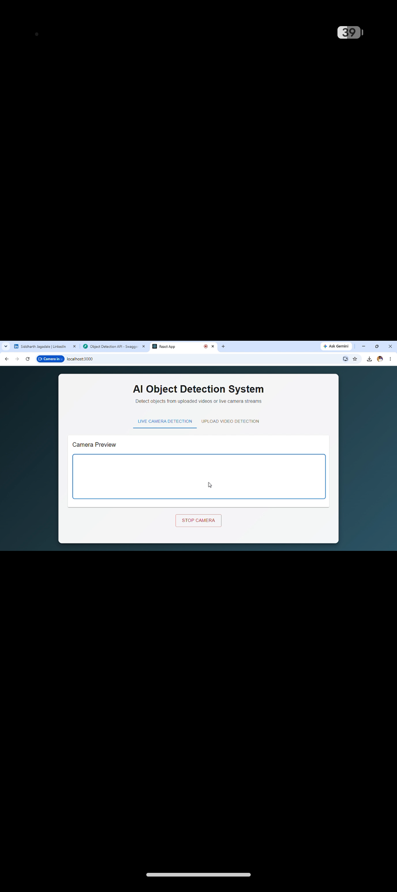
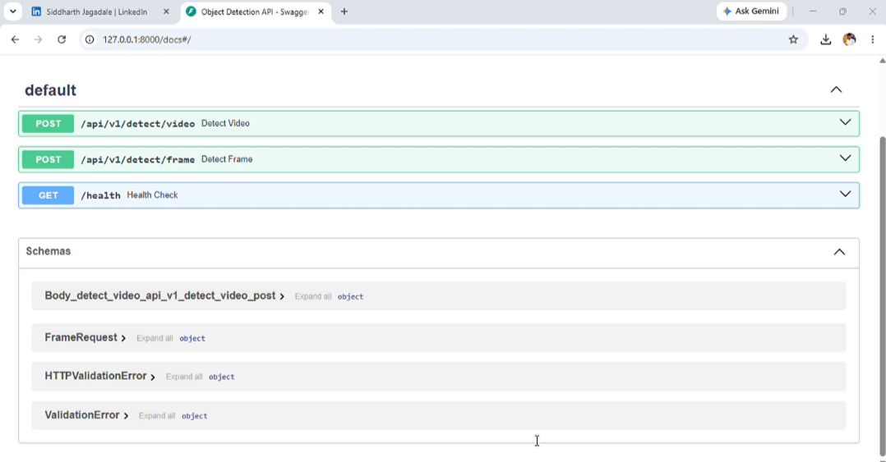
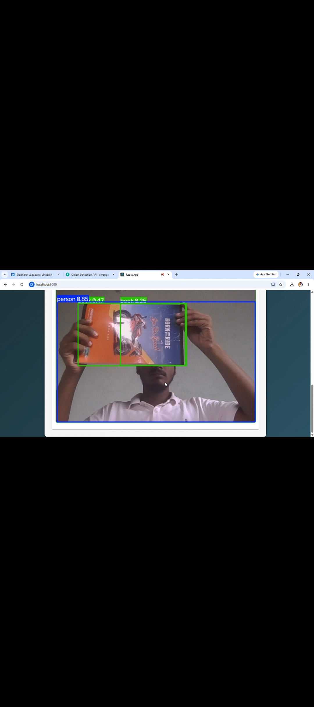
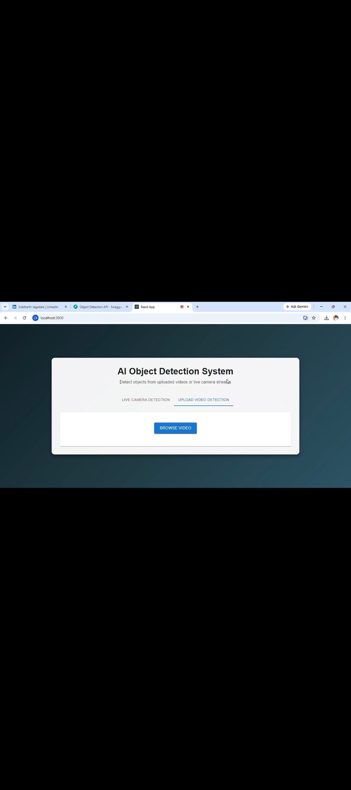
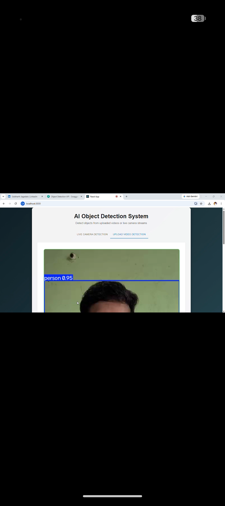
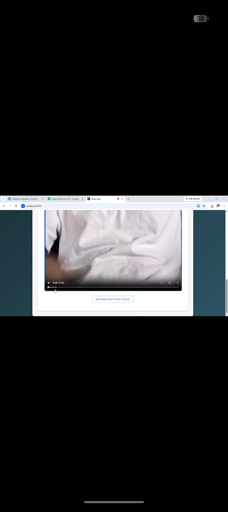

# 🚀 AI Object Detection System

An end-to-end AI-powered **Object Detection System** built using **YOLOv11**, **FastAPI**, **React.js**, and **OpenCV**.

The application supports:

- 📷 Real-time Live Camera Detection
- 🎥 Upload and Detect Objects in Videos
- ⚡ High-speed YOLOv11 Inference
- 📦 REST API with FastAPI
- 🖥️ Modern React Frontend

---

## 🖼️ Project Preview

### 🏠 Home Page



---

## ✨ Features

### 📷 Live Camera Detection

- Real-time webcam streaming
- Multiple object detection
- Bounding boxes
- Class labels
- Confidence scores
- Fast YOLOv11 inference

### 🎥 Video Upload Detection

- Upload MP4 videos
- Frame-by-frame detection
- Processed video preview
- Download processed video

### ⚡ FastAPI Backend

- REST API
- Swagger UI
- Modular architecture
- Video processing service
- Camera frame endpoint

### 🧠 AI Model

- YOLOv11 Nano
- Ultralytics
- OpenCV
- Real-time inference

---

# 🛠 Tech Stack

| Frontend | Backend | AI |
|----------|---------|----|
| React.js | FastAPI | YOLOv11 |
| HTML5 | Python | Ultralytics |
| CSS3 | OpenCV | NumPy |
| JavaScript | Uvicorn | |

---

# 📂 Project Structure

```text
AI-Object-Detection-System
│
├── backend
│   ├── app
│   ├── weights
│   ├── temp
│   ├── run.py
│   └── requirements.txt
│
├── frontend
│
├── README.md
├── docker-compose.yml
└── .gitignore
```

---

# 📷 Application Screenshots

## 🔹 Swagger API

Interactive FastAPI documentation.



---

## 🔹 Live Camera Detection

Start the webcam and perform real-time object detection.



---

## 🔹 Upload Video

Upload an MP4 video for object detection.



---

## 🔹 Detection Result

Detected objects are highlighted with bounding boxes and confidence scores.



---

## 🔹 Processed Video Output

Watch the processed output directly inside the application.



---

# ⚙️ Installation

## Clone Repository

```bash
git clone https://github.com/Siddharth3007Git/AI-Object-Detection-System.git
```

```bash
cd AI-Object-Detection-System
```

---

# 🔧 Backend Setup

```bash
cd backend
```

Create Virtual Environment

```bash
python -m venv venv
```

### Windows

```bash
venv\Scripts\activate
```

### Linux/macOS

```bash
source venv/bin/activate
```

Install dependencies

```bash
pip install -r requirements.txt
```

Run Backend

```bash
python run.py
```

Backend

```
http://localhost:8000
```

Swagger

```
http://localhost:8000/docs
```

---

# 💻 Frontend Setup

```bash
cd frontend
```

Install dependencies

```bash
npm install
```

Run

```bash
npm start
```

Frontend

```
http://localhost:3000
```

---

# 📡 API Endpoints

| Method | Endpoint | Description |
|--------|----------|-------------|
| GET | `/health` | Health Check |
| POST | `/api/v1/detect/frame` | Live Camera Detection |
| POST | `/api/v1/detect/video` | Video Detection |

---

# 🚀 Future Improvements

- Image Detection
- Object Tracking (ByteTrack)
- DeepSORT Integration
- Custom YOLO Training
- Docker Deployment
- GPU Acceleration
- AWS Deployment
- User Authentication
- Detection History
- Analytics Dashboard

---

# 👨‍💻 Author

## Siddharth Jagadale

**GitHub**

https://github.com/Siddharth3007Git

**LinkedIn**

https://www.linkedin.com/in/siddharth-jagadale

---

# ⭐ Support

If you found this project helpful, please consider giving it a **⭐ Star** on GitHub.

It motivates future development and helps others discover the project.

---

## 📜 License

This project is licensed under the **MIT License**.
